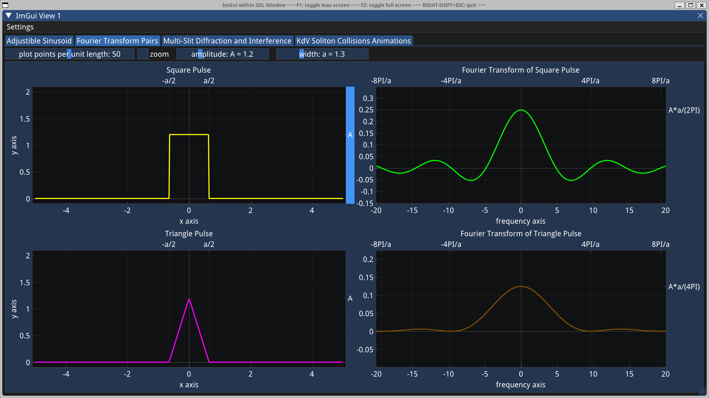
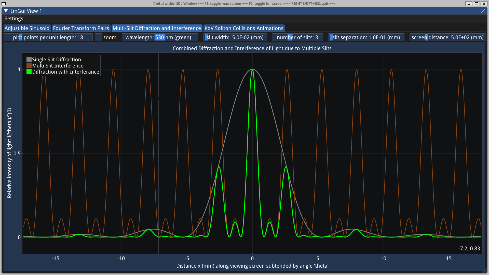
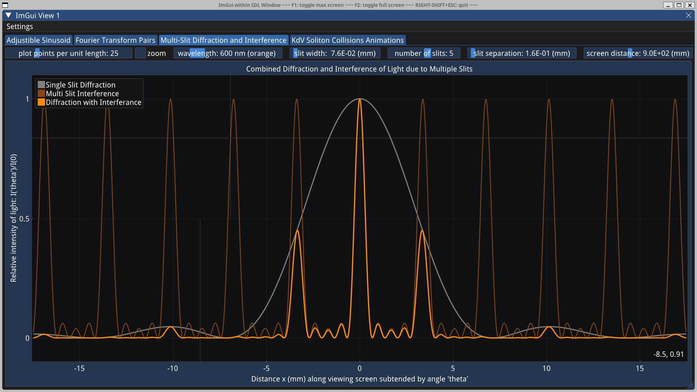
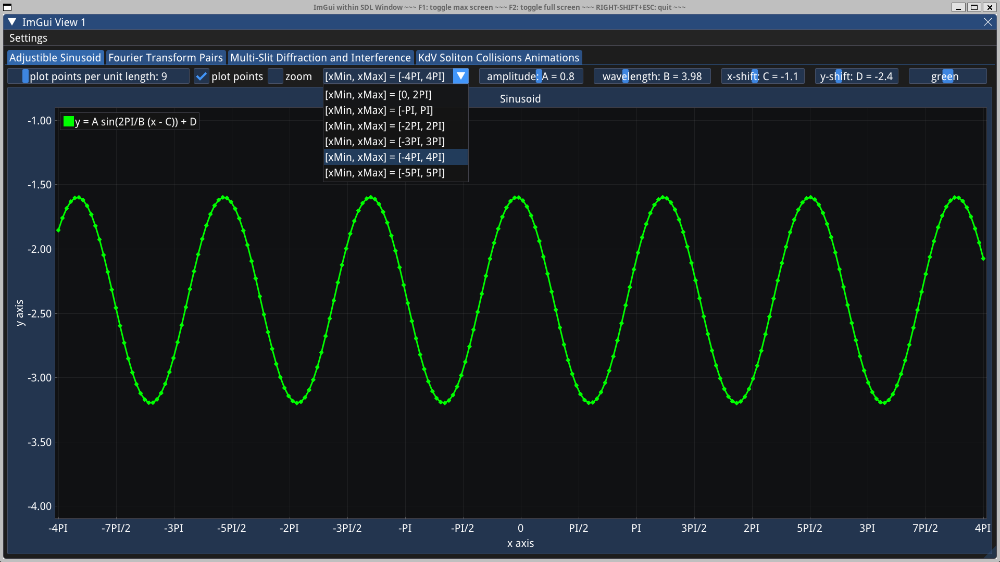

# ImPlot interactive graphs

This demo exemplifies how to use ImPlot (in conjunction with ImGui and SDL2 backend) to plot interactive graphs in a C++ program.

```
git clone --depth 1 https://github.com/MariuszJozef/ImGuiImPlotGraphs.git
cd ImGuiImPlotGraphs
```

If SDL2 is installed, provide a path to SDL2Config.cmake via `SDL2_DIR` as below (without square brackets); otherwise leave this flag off and SDL2 will be downloaded and built with the project.

```
cmake --preset Make-Gnu-Debug [ -D SDL2_DIR=/path/to/SDL2Config.cmake/ ]
cmake --build --preset Make-Gnu-Debug
cmake --build --preset Make-Gnu-Debug --target run
```

```
cmake --preset Make-Clang-Debug [ -D SDL2_DIR=/path/to/SDL2Config.cmake/ ]
cmake --build --preset Make-Clang-Debug
cmake --build --preset Make-Clang-Debug --target run
```

```
cmake --preset NMake-Msvc-Debug [ -D SDL2_DIR=/path/to/SDL2Config.cmake/ ]
cmake --build --preset NMake-Msvc-Debug
cmake --build --preset NMake-Msvc-Debug --target run
```

**N.B.**

- On Windows 11 it is preferable to issue the commands from **"Developer Command Prompt for VS 2022"** instead of regular PowerShell or CMD because the former has predefined Visual Studio environment variables which enable compilation with VS compiler.
- If nevertheless using PowerShell/CMD, or on Windows 10, one must first run some appropriate *.bat scripts that define VS environment variables.

## Fourier transform pairs

<!--  -->
<!--  -->
<!--  -->


## Collision animations of KdV solitons

### Two-soliton merge-split collision


### Two-soliton bounce-exchange collision


# Three-soliton collision (middle one stationary)


# Four-soliton collision


## Multi-slit diffraction and interference of light







## A sinusoid with adjustible parameters

<!--  -->


For a beginners example of how to use (in a C++ project) just ImGui without ImPlot, please refer to:
[SDLImGuiTriangle](https://github.com/MariuszJozef/SDLImGuiTriangle.git).
Other (CMake) ways to build the project are described there.
